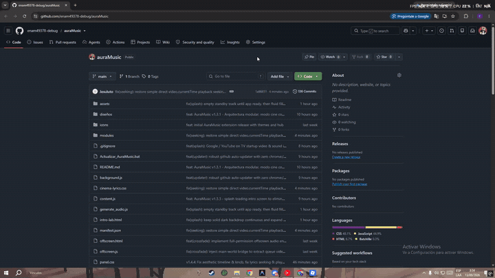

# 🎵 AuraMusic - Personalizador Avanzado para YouTube Music

AuraMusic es una extensión moderna (Manifest V3) que transforma por completo la experiencia visual y auditiva de **YouTube Music**.

---

## ✨ Características Principales

### 🎤 Modo Cine con Letras Sincronizadas y Animadas (Apple Music Sing Style)
- **Animación Palabra por Palabra**: Las palabras se elevan y brillan con un resplandor de neón en el momento exacto en que se cantan.
- **Interacción Total**: Haz clic en cualquier verso o palabra para saltar directamente a ese segundo con animación fluida inmediata.
- **Diseños y Temas Exclusivos**:
  - ✨ **AuraMusic Signature (Predeterminado)**: Estética insignia con neón holográfico cian/magenta, dock flotante con glassmorfismo, carril resplandeciente y **efectos de sonido hápticos de UI sintetizados con Web Audio API**.
  - 🌸 **Aesthetic Pastel**: Dock flotante pastel con respiración de vinilo, nubes y carril de onda multicolor con knob de 20px.
  - 🍎 **Apple Music Sing**: Pantalla completa cinematográfica con fondo líquido reactivo.
  - 🟢 **Spotify**: Tipografía limpia y dock centrado.
  - 💬 **WhatsApp**: Formato de chat interactivo con burbujas de mensajes y estado "escribiendo...".
  - 🌸 **Komi-san**: Tema morado/lila nocturno kawaii con stickers y lluvia de pétalos de sakura.
  - 🎮 **Jesuluto 3D**: Modelo 3D interactivo en WebGL (Three.js) bailando al ritmo del beat.
  - ⛏️ **Minecraft**: Estética voxel y tipografía pixel art.
  - 🤖 **Cyberpunk Mecha**: Neón cian y magenta angular futurista.

### 🌈 Malla Ambiental Radiante (Ambient Glow 4-Orb Mesh)
- **Extracción Inteligente de Colores**: Analiza la carátula del álbum en tiempo real, aislando los colores más vivos y vibrantes sin zonas negras muertas.
- **Rendimiento Ultraligero (0% CPU adicional)**: Generado mediante gradientes radiales elípticos procesados 100% en la GPU sin convolución gaussiana por software.

### 🔊 Efectos de Sonido Táctiles de UI (Exclusivo de AuraMusic)
- **Síntesis Procedural en Tiempo Real**: Generación instantánea mediante Web Audio API (0 latencia, sin archivos externos).
- Retroalimentación auditiva prémium para reproducción, pausa, saltos de verso, navegación de pistas y cambios de opciones.

### ⚡ Auto-Sync Engine y Calibración de Hardware
- **Detección de Latencia de Hardware**: Compensa automáticamente el buffer de salida de audio para una sincronización milimétrica entre voz y texto.
- **Controles de Micro-Ajuste**: Micro-nudge desde -0.5s hasta +0.5s para calibrar auriculares Bluetooth o DACs.

### 📊 Visualizadores de Audio en Tiempo Real y Ecualizador
- Visualizadores dinámicos integrados con Web Audio API y procesamiento en offscreen document.
- Presets de audio y ecualizador multibanda.

---

## 🚀 Instalación en Modo Desarrollador

### 📹 Video Tutorial de Instalación

¿Primera vez instalando una extensión? Mira la demostración animada paso a paso directamente aquí:

<div align="center">
  <a href="https://github.com/enam49378-debug/auraMusic/blob/main/media/auramusic-demo.mp4">
    
  </a>
  <p><em>🎬 Reproducción directa en GitHub. Haz clic en la imagen o en el siguiente enlace para verlo en video completo con audio:</em><br>
  👉 <a href="https://github.com/enam49378-debug/auraMusic/blob/main/media/auramusic-demo.mp4"><strong>Ver Video Tutorial Completo en Reproductor Web de GitHub</strong></a></p>
</div>

---

### 📋 Pasos Rápidos de Instalación:

1. **Descarga o Clona este repositorio:**
   ```bash
   git clone https://github.com/enam49378-debug/auraMusic.git
   ```
   *(O haz clic en el botón verde **Code** > **Download ZIP** en GitHub y descomprímelo en tu computadora).*
2. Abre Google Chrome o cualquier navegador basado en Chromium (Brave, Edge, Opera).
3. Dirígete a `chrome://extensions/`.
4. Activa el interruptor de **Modo de desarrollador** en la esquina superior derecha.
5. Haz clic en el botón **Cargar descomprimida** (*Load unpacked*) y selecciona la carpeta del proyecto.
6. Entra a [YouTube Music](https://music.youtube.com/) y ¡listo! Disfrutarás de la experiencia completa con el tema insignia AuraMusic activo por defecto.

---

## 🛠️ Estructura del Proyecto

```
ytm-auramusic/
├── manifest.json            # Manifiesto V3 de la extensión
├── content.js               # Script de contenido principal y orquestador
├── background.js            # Service worker en segundo plano
├── offscreen.html / .js     # Documento offscreen para procesamiento de audio
├── popup.html / .js / .css  # Menú emergente de la extensión
├── cinema-lyrics.css        # Estilos visuales del Modo Cine y temas
├── themes.css               # Temas de interfaz para YouTube Music
├── media/                   # Video tutorial de instalación y demostración
├── modules/
│   ├── ambient/             # Extracción de colores y malla ambiental
│   ├── audio/               # Motor de audio, ecualizador y UI sounds
│   ├── core/                # Puente con reproductor nativo, bridge y estado
│   ├── hub/                 # Panel flotante de controles
│   ├── lyrics/              # Motor de sincronización y letras animadas
│   ├── themes/              # Gestor modular de temas
│   └── visualizer/          # Visualizadores de audio
├── diseños/                 # Módulos de temas (Jesuluto, Komi, Minecraft, etc.)
└── icons/                   # Iconos de la extensión
```

---

## 📄 Licencia
Este proyecto es de uso personal y educativo. Todos los derechos reservados a sus respectivos autores.
